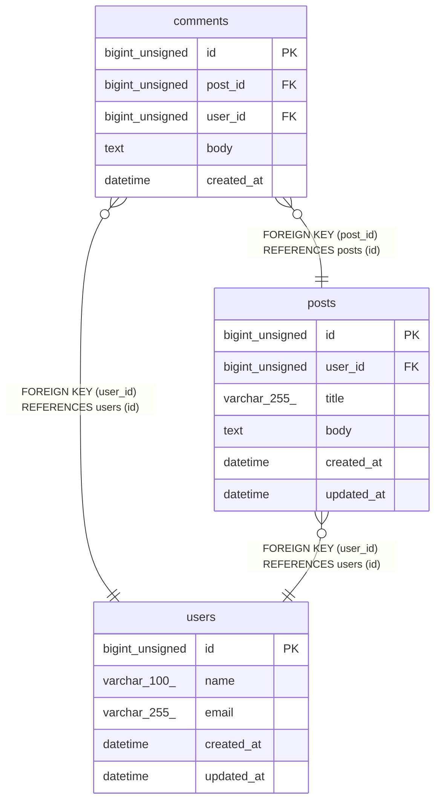

# sample

## Tables

| Name | Columns | Comment | Type |
| ---- | ------- | ------- | ---- |
| [comments](comments.md) | 5 | 投稿に対するコメントを管理するテーブル | BASE TABLE |
| [posts](posts.md) | 6 | ユーザーが投稿する記事を管理するテーブル | BASE TABLE |
| [users](users.md) | 5 | ユーザー | BASE TABLE |

## Relations

---

> Generated by [tbls](https://github.com/k1LoW/tbls)
