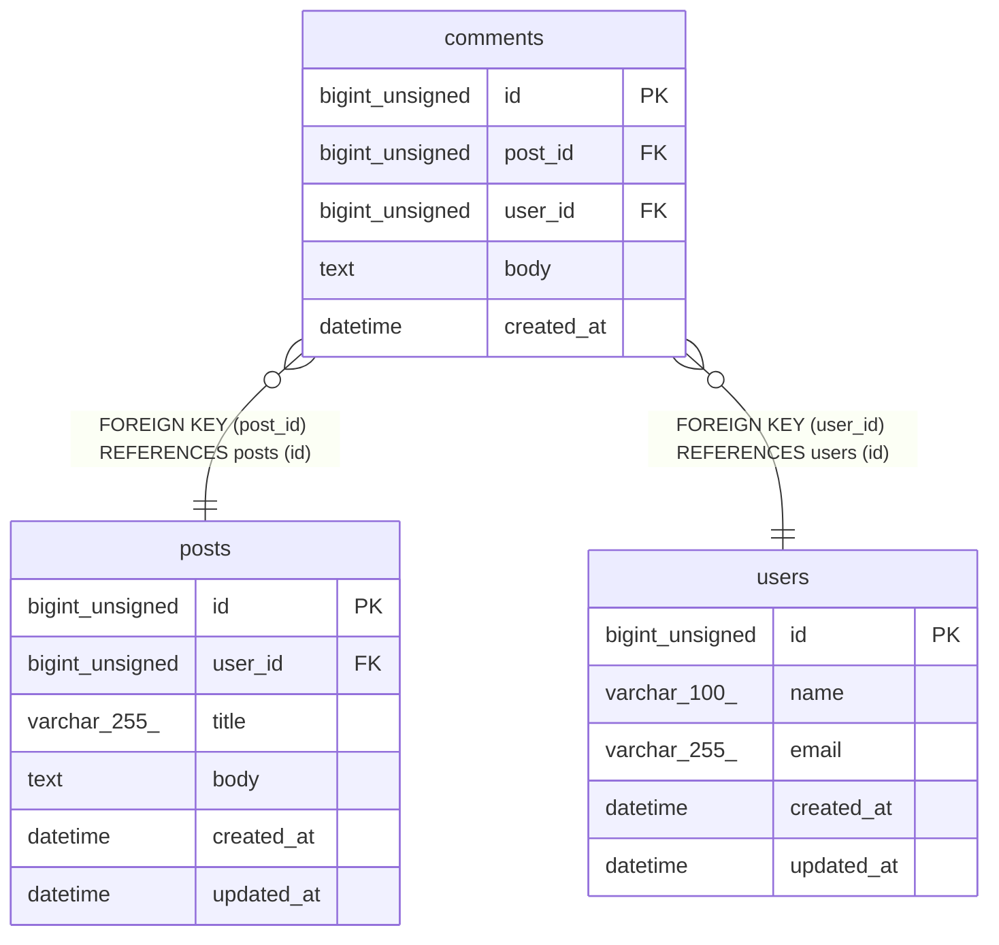

# comments

## Description

投稿に対するコメントを管理するテーブル

<details>
<summary><strong>Table Definition</strong></summary>

```sql
CREATE TABLE `comments` (
  `id` bigint unsigned NOT NULL AUTO_INCREMENT COMMENT 'コメントID',
  `post_id` bigint unsigned NOT NULL COMMENT '対象の投稿ID',
  `user_id` bigint unsigned NOT NULL COMMENT 'コメント投稿者のユーザーID',
  `body` text NOT NULL COMMENT 'コメント本文',
  `created_at` datetime NOT NULL DEFAULT CURRENT_TIMESTAMP COMMENT '作成日時',
  PRIMARY KEY (`id`),
  KEY `idx_comments_post_id` (`post_id`),
  KEY `idx_comments_user_id` (`user_id`),
  CONSTRAINT `fk_comments_post_id` FOREIGN KEY (`post_id`) REFERENCES `posts` (`id`) ON DELETE CASCADE,
  CONSTRAINT `fk_comments_user_id` FOREIGN KEY (`user_id`) REFERENCES `users` (`id`) ON DELETE CASCADE
) ENGINE=InnoDB DEFAULT CHARSET=utf8mb4 COLLATE=utf8mb4_0900_ai_ci COMMENT='コメント'
```

</details>

## Columns

| Name | Type | Default | Nullable | Extra Definition | Children | Parents | Comment |
| ---- | ---- | ------- | -------- | ---------------- | -------- | ------- | ------- |
| id | bigint unsigned |  | false | auto_increment |  |  | コメントID |
| post_id | bigint unsigned |  | false |  |  | [posts](posts.md) | 対象の投稿ID |
| user_id | bigint unsigned |  | false |  |  | [users](users.md) | コメント投稿者のユーザーID |
| body | text |  | false |  |  |  | コメント本文 |
| created_at | datetime | CURRENT_TIMESTAMP | false | DEFAULT_GENERATED |  |  | 作成日時 |

## Constraints

| Name | Type | Definition |
| ---- | ---- | ---------- |
| fk_comments_post_id | FOREIGN KEY | FOREIGN KEY (post_id) REFERENCES posts (id) |
| fk_comments_user_id | FOREIGN KEY | FOREIGN KEY (user_id) REFERENCES users (id) |
| PRIMARY | PRIMARY KEY | PRIMARY KEY (id) |

## Indexes

| Name | Definition |
| ---- | ---------- |
| idx_comments_post_id | KEY idx_comments_post_id (post_id) USING BTREE |
| idx_comments_user_id | KEY idx_comments_user_id (user_id) USING BTREE |
| PRIMARY | PRIMARY KEY (id) USING BTREE |

## Relations



---

> Generated by [tbls](https://github.com/k1LoW/tbls)
