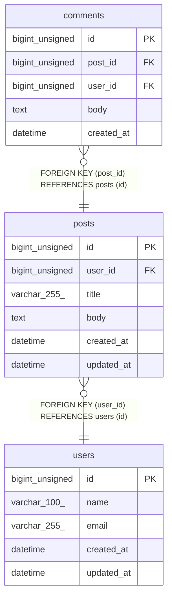

# posts

## Description

ユーザーが投稿する記事を管理するテーブル

<details>
<summary><strong>Table Definition</strong></summary>

```sql
CREATE TABLE `posts` (
  `id` bigint unsigned NOT NULL AUTO_INCREMENT COMMENT '投稿ID',
  `user_id` bigint unsigned NOT NULL COMMENT '投稿者のユーザーID',
  `title` varchar(255) NOT NULL COMMENT 'タイトル',
  `body` text NOT NULL COMMENT '本文',
  `created_at` datetime NOT NULL DEFAULT CURRENT_TIMESTAMP COMMENT '作成日時',
  `updated_at` datetime NOT NULL DEFAULT CURRENT_TIMESTAMP ON UPDATE CURRENT_TIMESTAMP COMMENT '更新日時',
  PRIMARY KEY (`id`),
  KEY `idx_posts_user_id` (`user_id`),
  CONSTRAINT `fk_posts_user_id` FOREIGN KEY (`user_id`) REFERENCES `users` (`id`) ON DELETE CASCADE
) ENGINE=InnoDB DEFAULT CHARSET=utf8mb4 COLLATE=utf8mb4_0900_ai_ci COMMENT='投稿'
```

</details>

## Columns

| Name | Type | Default | Nullable | Extra Definition | Children | Parents | Comment |
| ---- | ---- | ------- | -------- | ---------------- | -------- | ------- | ------- |
| id | bigint unsigned |  | false | auto_increment | [comments](comments.md) |  | 投稿ID |
| user_id | bigint unsigned |  | false |  |  | [users](users.md) | 投稿者のユーザーID |
| title | varchar(255) |  | false |  |  |  | タイトル |
| body | text |  | false |  |  |  | Markdown 形式で記述可能 |
| created_at | datetime | CURRENT_TIMESTAMP | false | DEFAULT_GENERATED |  |  | 作成日時 |
| updated_at | datetime | CURRENT_TIMESTAMP | false | DEFAULT_GENERATED on update CURRENT_TIMESTAMP |  |  | 更新日時 |

## Constraints

| Name | Type | Definition |
| ---- | ---- | ---------- |
| fk_posts_user_id | FOREIGN KEY | FOREIGN KEY (user_id) REFERENCES users (id) |
| PRIMARY | PRIMARY KEY | PRIMARY KEY (id) |

## Indexes

| Name | Definition |
| ---- | ---------- |
| idx_posts_user_id | KEY idx_posts_user_id (user_id) USING BTREE |
| PRIMARY | PRIMARY KEY (id) USING BTREE |

## Relations



---

> Generated by [tbls](https://github.com/k1LoW/tbls)
